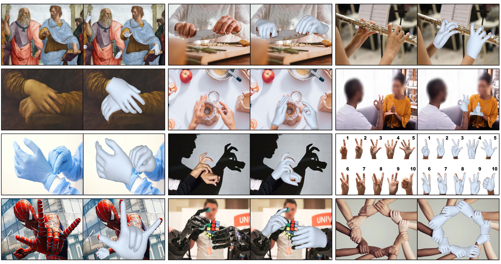

# Fast-HaMeR: Boosting Hand Mesh Reconstruction using Knowledge Distillation

This repository contains the code for the paper **Fast-HaMeR: Boosting Hand Mesh Reconstruction using Knowledge Distillation**. We accelerate 3D hand mesh reconstruction by:

1. **Replacing the HaMeR ViT-H backbone** with lightweight alternatives: MobileNet, MobileViT, ConvNeXt, and ResNet.
2. **Training student models with knowledge distillation** using three strategies: **output-level**, **feature-level**, and **combined** (hybrid of both).

Our best configurations reach ~35% of the original model size, **1.5× faster inference**, with a minimal accuracy difference of **0.4 mm** on HO3D-v2. The approach is suitable for real-time use on resource-constrained devices (e.g. headsets, smartphones).

Fast-HaMeR builds on [HaMeR](https://geopavlakos.github.io/hamer/) (Pavlakos et al., 2024). The paper PDF is available in the [docs/](docs/) folder.



## Installation

Clone this repository (and submodules if any):

```bash
git clone --recursive https://github.com/hunainahmedj/Fast-HaMeR.git
cd Fast-HaMeR
```

Create a virtual environment (venv or conda):

```bash
python3.10 -m venv .venv
source .venv/bin/activate   # or: conda create -n fast-hamer python=3.10 && conda activate fast-hamer
```

Install dependencies (CUDA 11.7 example; adjust for your driver):

```bash
pip install torch torchvision --index-url https://download.pytorch.org/whl/cu117
pip install -e .[all]
pip install -v -e third-party/ViTPose
```

Optional: use `project_dependencies.txt` as a pinned reference for the full environment.

Download demo data and place the MANO model:

```bash
bash fetch_demo_data.sh
```

Place the right-hand MANO model from the [MANO website](https://mano.is.tue.mpg.de) as `_DATA/data/mano/MANO_RIGHT.pkl`.

### Docker

```bash
docker compose -f ./docker/docker-compose.yml up -d
docker compose -f ./docker/docker-compose.yml exec hamer-dev /bin/bash
# then run fetch_demo_data.sh and MANO setup as above
```

## Project structure

| Entry point | Description |
|------------|-------------|
| `train.py` | Baseline HaMeR-style training (ViT backbone). |
| `train_knowledge_dist.py` | Knowledge distillation training (student backbones + KD). |
| `eval.py` | Evaluation on FreiHAND, HO3D, HInt, etc. |
| `demo.py` | Demo on an image folder. |
| `demo_image.py` | Single-image demo. |

Configs: `hamer/configs_hydra/` (Hydra: experiments, trainer, paths, data) and `hamer/configs/` (YACS: datasets, eval). Data and log paths can be overridden via `hamer/configs_hydra/paths/default.yaml` and `hamer/configs/datasets_eval.yaml`.

## Training

### Baseline (HaMeR-style)

Train the full ViT-based model:

```bash
python train.py exp_name=hamer data=mix_all experiment=hamer_vit_transformer trainer=gpu launcher=local
```

Checkpoints and logs are written under `./logs/` (configurable in `hamer/configs_hydra/paths/default.yaml`).

### Knowledge distillation

Download training data and start KD training:

```bash
bash fetch_training_data.sh
./train.sh MY_EXP_NAME mobilenet_large_kd_full
```

- `MY_EXP_NAME`: experiment name (used for log/checkpoint paths).
- Second argument is the **experiment config** name under `hamer/configs_hydra/experiment/`.

Available experiment configs include backbone variants (e.g. `resnet_50`, `mobilenet_large`, `convnext_large`, `mobilevit_small`) and KD variants matching the paper:

- `*_kd_outputs` – **output-level** distillation (student matches teacher predictions).
- `*_kd_features` – **feature-level** distillation (student features match teacher features).
- `*_kd_full` – **combined** distillation (output + feature level).

The teacher checkpoint is taken from the default HaMeR checkpoint (after `fetch_demo_data.sh`). Override with the `TEACHER_CKPT` environment variable if needed.

## Evaluation

1. Download [evaluation metadata](https://www.dropbox.com/scl/fi/7ip2vnnu355e2kqbyn1bc/hamer_evaluation_data.tar.gz?rlkey=nb4x10uc8mj2qlfq934t5mdlh) into `./hamer_evaluation_data/`.
2. Download FreiHAND, HO-3D, and HInt images and set the paths in `hamer/configs/datasets_eval.yaml` (e.g. `IMG_DIR` for each dataset).
3. Run evaluation:

```bash
# Direct call with checkpoint path
python eval.py --dataset 'HO3D-VAL' --checkpoint path/to/checkpoint.ckpt --efficient_hamer --results_folder results/my_exp --metrics_folder results/

# Or use eval.sh: ./eval.sh EXPERIMENT_NAME [CHECKPOINT_PATH]
# If CHECKPOINT_PATH is omitted, uses ./logs/train/runs/EXPERIMENT_NAME/checkpoints/last.ckpt
./eval.sh my_kd_run
./eval.sh my_kd_run /path/to/custom.ckpt
```

Results are written to `results/` and (for FreiHAND/HO3D) as `.json` for their official evaluation.

## Demo

**Image folder:**

```bash
python demo.py --img_folder example_data --out_folder demo_out --batch_size=48 --side_view --save_mesh --full_frame
```

**Single image:**

```bash
python demo_image.py --img path/to/image.jpg --out_folder demo_out
```

To use an efficient (student) checkpoint, pass `--checkpoint path/to/student.ckpt`. For student models, the eval/demo code uses the efficient loader when appropriate (e.g. `eval.py --efficient_hamer`).

Optional demos (PyTorch3D rendering, TensorRT, RTMPose) are under `scripts/`; see `scripts/README.md`.

## Config and data paths

- **Log and output dirs:** `hamer/configs_hydra/paths/default.yaml` (e.g. `log_dir`).
- **MANO and default experiment paths:** `hamer/configs_hydra/experiment/default.yaml` (e.g. `MANO.DATA_DIR`).
- **Eval dataset image dirs:** `hamer/configs/datasets_eval.yaml` (set `IMG_DIR` for each dataset).
- **Training webdataset tars and mocap:** `hamer/configs/datasets_tar.yaml`. Place `freihand_mocap.npz` as indicated (e.g. under `hamer_training_data/`) or override the path.
- **ViT pretrained weights:** In `hamer/configs_hydra/experiment/hamer_vit_transformer*.yaml`, set `PRETRAINED_WEIGHTS` to your path (e.g. `_DATA/vitpose_backbone.pth`) after downloading.

## HInt dataset

HInt annotations are available from the [HInt repository](https://github.com/ddshan/hint). Use them with the eval paths above as needed.

## Acknowledgements

This work is based on [HaMeR](https://geopavlakos.github.io/hamer/). Parts of the code are taken or adapted from:

- [HaMeR](https://github.com/geopavlakos/hamer) (Pavlakos et al.)
- [4DHumans](https://github.com/shubham-goel/4D-Humans), [SLAHMR](https://github.com/vye16/slahmr), [ProHMR](https://github.com/nkolot/ProHMR), [SPIN](https://github.com/nkolot/SPIN), [SMPLify-X](https://github.com/vchoutas/smplify-x), [HMR](https://github.com/akanazawa/hmr), [ViTPose](https://github.com/ViTAE-Transformer/ViTPose), [Detectron2](https://github.com/facebookresearch/detectron2)

## Citing

If you use this code or build on HaMeR, please cite the original HaMeR paper:

```bibtex
@inproceedings{pavlakos2024reconstructing,
    title={Reconstructing Hands in 3{D} with Transformers},
    author={Pavlakos, Georgios and Shan, Dandan and Radosavovic, Ilija and Kanazawa, Angjoo and Fouhey, David and Malik, Jitendra},
    booktitle={CVPR},
    year={2024}
}
```

If you use Fast-HaMeR, please cite our paper:

```bibtex
@article{jillani2025fasthamer,
  title={Fast-{HaMeR}: Boosting Hand Mesh Reconstruction using Knowledge Distillation},
  author={Jillani, Hunain Ahmed and Aboukhadra, Ahmed Tawfik and Elhayek, Ahmed and Malik, Jameel and Robertini, Nadia and Stricker, Didier},
  journal={...},
  year={2025}
}
```

(Update `journal` with the actual venue when published. The paper PDF is in [docs/](docs/).)
